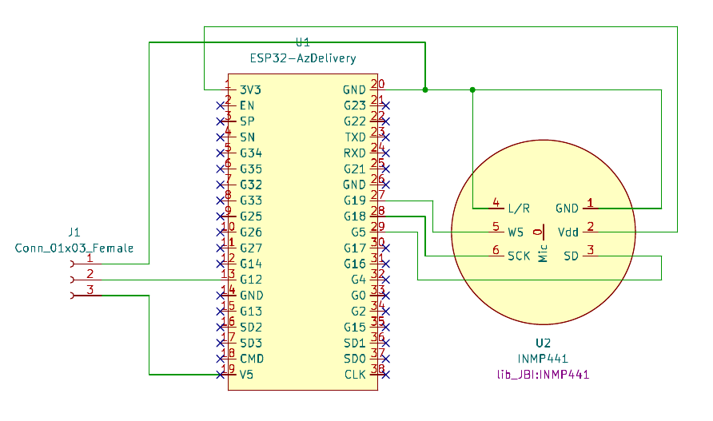
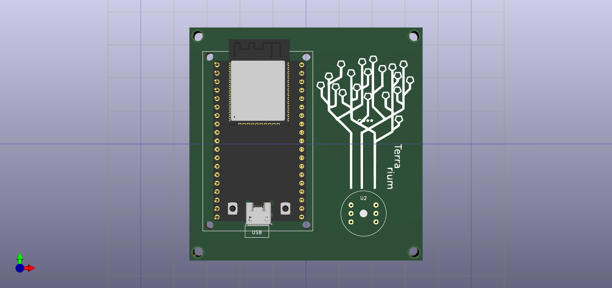

# Terra light

## Concepts 
Remote access to a neopixel strip via micropython and web servers.

## Visuals
The main device looks like:

  

## Hardware
### Elec design
The schematic and pcb design has been designed via KiCad:

  
  

## Roadmap
This is the expected roadmap for this project:

### Proof of concept: version 0.0.1
- [x] Create webserver via micropython.
- [x] Test the control of leds.
- [x] KiCad design. 

### Audio recognition: version 0.0.2
- [ ] Integrate INMP441 device.
- [ ] Get audio samples
- [ ] Use Tensorflow micropython [https://github.com/mocleiri/tensorflow-micropython-examples/tree/main]
